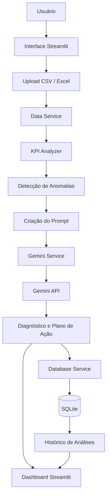
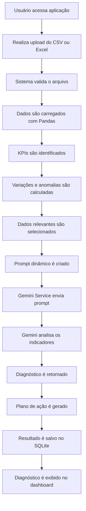

# Analisador Inteligente de KPIs e Métricas

## 1. Visão geral

O **Analisador Inteligente de KPIs e Métricas** é um MVP desenvolvido em Python com o objetivo de auxiliar gestores e profissionais de negócios na análise de indicadores corporativos.

A aplicação permite que o usuário faça upload de arquivos **CSV ou Excel** contendo dados relacionados a áreas como:

- Vendas;
- Marketing;
- Atendimento e suporte;
- Financeiro;
- Operações;
- Conversão;
- Faturamento;
- Ticket médio;
- Quantidade de clientes;
- Churn;
- Outros indicadores de negócio.

Após o carregamento dos dados, o sistema realiza uma análise inicial das métricas para identificar **quedas, variações relevantes e possíveis anomalias nos KPIs**.

As informações relevantes são então estruturadas e enviadas para a **API Gemini**, que atua como um consultor de negócios, analisando os dados para:

- Identificar os principais problemas;
- Detectar anomalias;
- Correlacionar diferentes métricas;
- Levantar possíveis causas-raiz;
- Explicar o impacto dos problemas;
- Sugerir ações estratégicas;
- Gerar um plano de ação.

O resultado da análise é apresentado ao usuário através de uma interface em Streamlit e armazenado no banco de dados SQLite para consultas futuras.

---

## 2. Objetivos

### 2.1 Objetivo principal

Desenvolver uma aplicação capaz de utilizar **Inteligência Artificial generativa para analisar dados empresariais e transformar métricas e KPIs em diagnósticos e recomendações estratégicas**.

O sistema tem como principal propósito auxiliar o gestor a responder:

> **Por que meu KPI caiu e o que devo fazer para recuperá-lo?**

### 2.2 Objetivos secundários

- Permitir upload de arquivos CSV e Excel;
- Realizar tratamento e validação dos dados;
- Identificar os principais KPIs disponíveis;
- Detectar variações relevantes nos indicadores;
- Identificar possíveis anomalias;
- Preparar os dados para envio à IA;
- Integrar a aplicação com a API Gemini;
- Criar prompts estruturados para análise empresarial;
- Gerar diagnósticos utilizando IA;
- Gerar recomendações estratégicas;
- Gerar planos de ação;
- Persistir as análises realizadas;
- Criar histórico de diagnósticos;
- Desenvolver uma interface simples e intuitiva;
- Demonstrar uma arquitetura modular e escalável.

---

## 3. System Design da aplicação

### 3.1 Design



### 3.2 Fluxo da aplicação



### 3.3 Fluxo resumido

```text
Usuário acessa aplicação
        ↓
Faz upload do arquivo
        ↓
Sistema valida os dados
        ↓
Dados são processados
        ↓
KPIs são identificados
        ↓
Anomalias são detectadas
        ↓
Prompt é criado
        ↓
Gemini API analisa os dados
        ↓
Diagnóstico é gerado
        ↓
Plano de ação é criado
        ↓
Resultado é salvo no SQLite
        ↓
Diagnóstico é exibido na interface
```

---

## 4. Ferramentas utilizadas

| Ferramenta | Utilização |
|---|---|
| **Python** | Linguagem principal utilizada no desenvolvimento da aplicação |
| **Streamlit** | Construção da interface e dashboard da aplicação |
| **Gemini API** | Análise dos dados, identificação de possíveis causas e geração do plano de ação |
| **Pandas** | Leitura, tratamento, transformação e análise dos dados dos arquivos CSV e Excel |
| **SQLite** | Banco de dados utilizado para persistência das análises |
| **SQLAlchemy** | Abstração e gerenciamento da comunicação entre a aplicação e o banco de dados |
| **python-dotenv** | Gerenciamento das variáveis de ambiente e da chave da API |
| **OpenPyXL** | Leitura e processamento de arquivos Excel |
| **Git** | Controle de versão do código-fonte |
| **GitHub** | Hospedagem do repositório e gerenciamento do projeto |

---

## 5. Estrutura de pasta do projeto

```text
kpi-business-analyzer/
│
├── app.py
├── database.db
├── requirements.txt
├── .env
├── .env.example
├── .gitignore
├── README.md
│
├── config/
│   └── settings.py
│
├── services/
│   ├── gemini_service.py
│   ├── database_service.py
│   └── data_service.py
│
├── analyzers/
│   ├── kpi_analyzer.py
│   └── anomaly_detector.py
│
├── prompts/
│   └── business_diagnostic_prompt.py
│
├── models/
│   └── business_analysis.py
│
├── database/
│   └── db.py
│
├── utils/
│   ├── formatter.py
│   └── validators.py
│
└── data/
    └── uploads/
```

---

## 6. Benefícios do projeto

### Benefícios para o negócio

- Redução do tempo necessário para análise de indicadores;
- Facilitação da interpretação de dados;
- Identificação mais rápida de problemas;
- Auxílio na tomada de decisões;
- Transformação de dados em recomendações estratégicas;
- Centralização dos diagnósticos;
- Criação de histórico das análises realizadas.

### Benefícios técnicos

- Aplicação prática de Python;
- Integração com API de Inteligência Artificial;
- Utilização de engenharia de prompts;
- Processamento de dados com Pandas;
- Persistência de informações com SQLite;
- Utilização de SQLAlchemy;
- Desenvolvimento de interface com Streamlit;
- Separação de responsabilidades entre componentes;
- Utilização de variáveis de ambiente;
- Integração entre diferentes serviços;
- Aplicação prática de Inteligência Artificial generativa.

---

## 7. Configuração da Gemini API

Copie o arquivo `.env.example` para `.env` e informe sua chave da Gemini API:

```env
CHAVE_API=sua_chave_gemini
NOME_API=gemini-2.5-flash
```

Mantenha o arquivo `.env` local e não compartilhe sua chave. Para iniciar a
aplicação, execute `streamlit run app.py`. Ao clicar em **Analisar indicadores**,
o sistema calcula os KPIs do arquivo enviado, envia o resumo para a Gemini API
e apresenta o diagnóstico na interface.

## 8. Conclusão do projeto

O **Analisador Inteligente de KPIs e Métricas** combina desenvolvimento de sistemas, processamento de dados e Inteligência Artificial generativa para auxiliar na interpretação de indicadores empresariais.

A aplicação recebe dados de negócio através de arquivos CSV ou Excel, realiza uma análise inicial dos KPIs, identifica variações e possíveis anomalias e utiliza a **Gemini API** para interpretar os resultados.